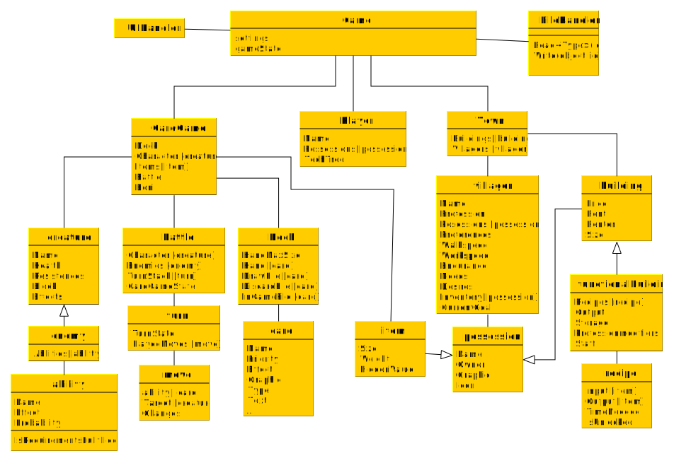

[TOC]

# What is Project: U?

Project: U is a game I am developing / developed to get started with Unity. It is purely for myself and it’s only purpose is to grow by creating it.

I started it without knowing what direction to go with it… My first idea was to sort of rebuild/clone Master of Orion II since I loved that game when I was younger (and till now) but soon I  realized that a multiplayer game / game that would require to have an AI play against you, wouldn’t be satisfying to make / hard to test / hard to develop.
–> Project: U. A name not committed to anything yet. Project as this is not something I will just do in a short time and forget but something that is bigger and has more structure and is more fleshed out than the small little programs I previously made. Also I like the ambiguity of the word “Project” as it has more meanings than just a plan on which someone is working. 
The second part also has multiple meanings: U for Unity – but also for the unknown / undecided. I guess I can **U**se the U pretty **U**niversal in the game and what it really will mean in the end is open for now. (U = Upgrade?)

What I wanted to do with this project is to not just start programming like I used to do with other projects.
I wanted to make it a good and well structured project. Built step by step. To try to introduce good habits and work on my bad ones. Actually plan things before I tackle them (and that includes for example but not only test-driven development). Having a well thought through plan and overview and execution.

This document is where I hope to get a lot of my structure down. This will include mockups, plans, To Dos, concept ideas, the journey from where I started to where I am right now. (Which is odd to write at the moment, since where I started is where I am right now but I guess it will make sense when I )

# Concept

-   **2018-11-17:** 
    -   I don’t know yet :D. 
    -   I ruled out multiplayer as I want the game to be playable/testable alone and creating an AI is not what I want to do. Not that I don’t know how – I already made small AI’s (e.g. for [Screeps](https://screeps.com)) – I just don’t want to bother about it. -> With that a clone of Master of Orion II is out of the window. 
    -   Still thinking about some sort of an economy game where you have to build up things, upgrade them, research, unlock, make choices when to do what, etc. 
    -   Still thinking about a clone of [Slay the Spire](https://store.steampowered.com/app/646570/Slay_the_Spire/) or some other kind of deckbuilding game – nice for single player experience with inbuild replayability and easy concept to program
        -   Why not combine them? :O That is a great idea! You have to build up your economy and you have to pay to embark into a dungeon / whatever and you get rewards in there. With several different resources you can unlock possible cards / equipment for the mission / powerups etc. :thinking: I have the feeling that something like that already exists… but I like the idea!
            This makes it modular… I could write the economy and the deckbuilding / fighting part separately.
-   **2018-11-18:**
    -   Lets go with the economy / deckbuilding concept for now and see where it leads us.
    -   every building, card and everything will be a human readable file (JSON?) that the game will read and automatically add when the game boots up - easy adding and balancing
    -   economy 
        -   start in small town
        -   will stay and built up during the game
        -   production chains – think Stronghold Crusader
            -   is placement important? – transportation between steps and storage
                or will it just build building and everything gets into / gets taken out of storage immediately
            -   upkeep of buildings
            -   upgrades that you have to decide on for example “building produces 50% faster” or “upkeep costs 50% less” or “requires 50% less resources” or “additionally produces x as byproduct” - you can swap them if you use some findable items
                Will upgrades be building specific or building-type specific? Probably the latter one.
                Upgrade- / Building- /Techtree?
        -   you will start with no responsibility at all and no needs to fulfill - if you build a building / economy thing it will require you to pay upkeep (upkeep will be specific not general money look below) if you can’t pay that after a while you go in debt and you get problems regarding this production chain
        -   if you want to build certain buildings you need the people to trust you first (you are not yet the person running the town) and for that you need to provide goods for them on a regular basis
            => step by step give the player more options to chose from but limit them to do them all at once
        -   you don’t have to start with food or anything, instead you can start where you want depending on what you want to get out of it (make different foods for different parts of the society, make perfume for high society, create weapons/iron tools, …)
        -   town will grow and new needs that you can (but not must!) fulfill will open up
        -   Resources:
            -   will there be money? Or will Gold be a resource but there won’t be a major payment system (but probably in the back everything will have a value that gets assigned)?
                => address the feeling to trade with goods better than just to have like a market where you trade everything to money and then buy stuff with money
                I think I like the no money aspect. The worth of goods will be different for different persons.
    -   missions / deckbuilding
        -   will reset every time when you embark

# Project structure

## Classes

# Changelog

## 2018-11-17

-   Started the project by creating this readme file and writing [What is Project: U?](#What is Project: U?)
-   Added [Changelog](#changelog) + [the first entry](#2018-11-17)

## 2018-11-18

-   Decided on a very rough [Concept](#Concept). It will be economics based (think building up chains of productions like Stronghold Crusader). Feed your people keep them happy. Get funds and equipment to embark for missions in which you can find helpful things for the building town (for example freeing an architect to get access on other buildings, blueprints for other equipment, rare ingredients for things, …)
-   Added first version of the [Class Diagram](#Classes) in [Project Structure](#Project Structure). Got a first understanding what I want to do. 